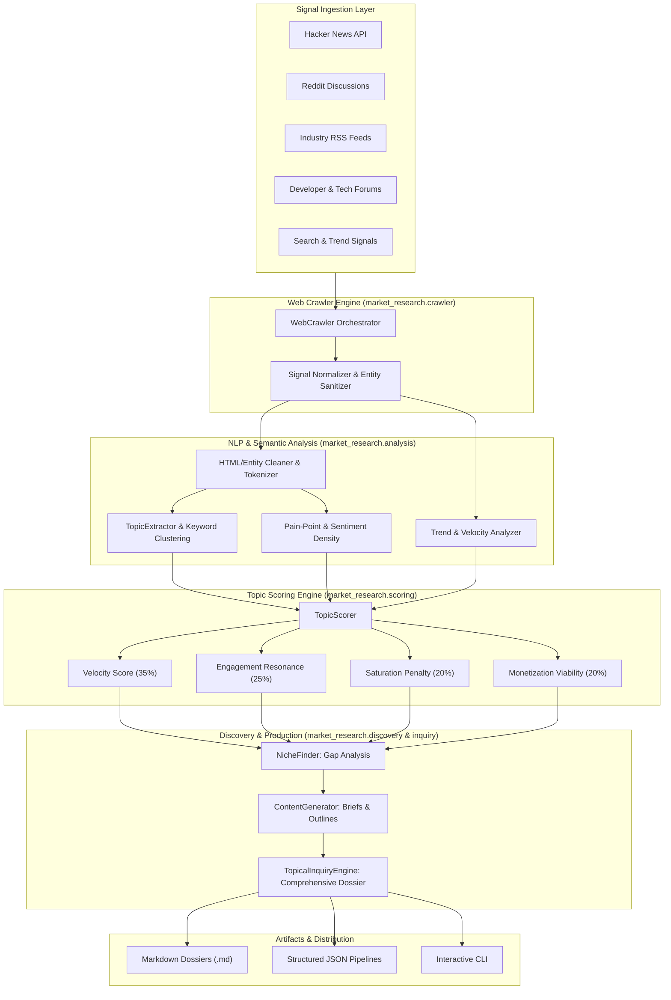

# Market Research (`market-research`)

[](https://www.python.org/)
[](LICENSE)
[]()
[]()

An automated intelligence platform, multi-source web crawler, and topic scoring engine designed for **content generation** and **deep topical inquiry**.

`market-research` continuously crawls and ingests active conversations across the web (community forums, Reddit, Hacker News, RSS feeds, search trend queries), clusters signals into semantic topics, calculates a multi-dimensional opportunity score, isolates underserved content niches, and generates production-ready content briefs.

---

## Table of Contents

- [Overview & Problem Statement](#overview--problem-statement)
- [Core Architecture](#core-architecture)
- [Key Features](#key-features)
- [Multi-Factor Scoring Methodology](#multi-factor-scoring-methodology)
- [Repository Structure](#repository-structure)
- [Installation & Quickstart](#installation--quickstart)
- [CLI Reference](#cli-reference)
- [Python SDK Usage](#python-sdk-usage)
- [Configuration](#configuration)
- [Running Tests](#running-tests)
- [Roadmap](#roadmap)
- [License](#license)

---

## Overview & Problem Statement

Modern content marketing, technical writing, and product research often suffer from three critical bottlenecks:
1. **Chasing Stale Keyword Data:** Traditional SEO keyword tools show historical averages that lag weeks or months behind real-world internet discussions.
2. **Red Ocean Saturation:** Generic high-volume keywords are saturated with high-authority domain incumbents, making organic reach nearly impossible.
3. **Disconnected Content Ideation:** Research rarely translates directly into actionable content outlines that answer the exact pain points and questions audience members are asking right now.

`market-research` solves this by functioning as an end-to-end **signal harvester**, **topic scoring algorithm**, and **content brief synthesizer**. It identifies active discussion spikes, quantifies pain points and commercial intent, and isolates underserved "blue ocean" niches ripe for high-ROI content generation.

---

## Core Architecture



---

## Key Features

- **Multi-Source Signal Web Crawler:** Ingests live community posts, questions, and discussions across Hacker News, Reddit, RSS syndications, and search trends with built-in rate-limiting and user-agent rotation.
- **Topical Clustering & NLP Extraction:** Normalizes discussion feeds, filters conversational stop words, extracts user questions (PAA - *People Also Ask*), and groups signals into thematic clusters.
- **Pain-Point & Frustration Density:** Quantifies user complaints, bottlenecks, and software limitations to detect underserved market friction.
- **Multi-Factor Topic Scoring:** Evaluates topic momentum, comment depth, saturation, and buyer intent into a single 0-100 composite **Opportunity Score**.
- **Niche Discovery & Gap Detection:** Flags high-velocity, low-saturation niches where demand is spiking but authoritative solutions are lacking.
- **Topical Inquiry System:** Generates deep-dive dossiers on any specific subject with one command.
- **Production-Ready Content Briefs:** Automatically drafts content titles, high-converting hooks, multi-part structured outlines, and target keyword clusters.

---

## Multi-Factor Scoring Methodology

Every topic cluster is evaluated across five objective metrics:

$$\text{Opportunity Score} = (V \cdot w_v) + (E \cdot w_e) + (M \cdot w_m) - (S_{\text{adj}} \cdot w_s \cdot 0.5) + (P \cdot 25.0)$$

| Metric | Weight | Description |
| :--- | :---: | :--- |
| **Velocity Score ($V$)** | 35% | Evaluates the rate of new conversation arrivals over recent 24-48h windows and growth momentum. |
| **Engagement Resonance ($E$)** | 25% | Measures depth of community response, comment-to-upvote ratios, and debate intensity. |
| **Monetization Viability ($M$)** | 20% | Detects commercial keywords (`best`, `vs`, `pricing`, `tool`, `alternative`, `enterprise`) indicating buyer intent. |
| **Saturation Penalty ($S_{\text{adj}}$)** | 20% | Penalizes crowded topics dominated by generic incumbents, discounted by detected pain points. |
| **Pain Density Bonus ($P$)** | +25 Bonus | Rewards topics characterized by user frustration, bugs, and unsolved bottlenecks. |

*The resulting Composite Opportunity Score is normalized to a bounded scale between 0.0 and 100.0.*

---

## Repository Structure

```
market-research/
├── .gitignore                      # Git ignore rules for Python, caches, and datasets
├── LICENSE                         # MIT License
├── README.md                       # Complete platform documentation
├── pyproject.toml                  # Python package configuration and CLI entry points
├── config.example.yaml             # Example runtime and crawler configuration
├── market_research/                # Core application package
│   ├── __init__.py                 # Package exports and version metadata
│   ├── __main__.py                 # Module execution entry point
│   ├── cli.py                      # CLI commands (inquire, crawl, score, discover)
│   ├── config.py                   # Configuration dataclasses and loader
│   ├── models.py                   # Data schemas (RawSignal, TopicScore, ContentBrief, etc.)
│   ├── crawler/                    # Signal ingestion layer
│   │   ├── __init__.py
│   │   ├── base.py                 # Abstract BaseCrawler and CrawlResult
│   │   ├── sources.py              # Source definitions and feed metadata
│   │   └── web_crawler.py          # Multi-source crawler implementation
│   ├── analysis/                   # Semantic and trend analysis
│   │   ├── __init__.py
│   │   ├── nlp.py                  # Tokenizer, stop words, pain/buyer intent detection
│   │   └── trends.py               # Temporal velocity and engagement resonance
│   ├── scoring/                    # Algorithmic scoring engine
│   │   ├── __init__.py
│   │   ├── metrics.py              # Scoring metrics and weight definitions
│   │   └── scorer.py               # TopicScorer implementation
│   ├── discovery/                  # Niche and content production
│   │   ├── __init__.py
│   │   ├── niche_finder.py         # Niche identification and gap analysis
│   │   └── content_generator.py    # Automated content brief and outline synthesizer
│   └── inquiry/                    # Topical inquiry orchestration
│       ├── __init__.py
│       └── topical_inquiry.py      # TopicalInquiryEngine & dossier export
└── tests/                          # Automated test suite
    ├── __init__.py
    ├── test_crawler.py             # Crawler and signal harvesting tests
    ├── test_scorer.py              # NLP clustering and scoring formula tests
    ├── test_niche_finder.py        # Niche identification and brief generation tests
    └── test_topical_inquiry.py     # End-to-end inquiry pipeline tests
```

---

## Installation & Quickstart

### Prerequisites

- Python 3.10 or higher
- Git

### Setup

```bash
# 1. Clone repository
git clone https://github.com/LukeH/market-research.git
cd market-research

# 2. (Optional) Create virtual environment
python -m venv .venv

# On Windows:
.venv\Scripts\activate
# On Linux/macOS:
source .venv/bin/activate

# 3. Install in editable mode
pip install -e .
```

---

## CLI Reference

The CLI provides subcommands for topical inquiry, crawling, scoring, and niche discovery:

### 1. Run a Deep Topical Inquiry
Performs full pipeline execution: crawling, clustering, scoring, and outputting an actionable research dossier.

```bash
# Output dossier directly to terminal
market-research inquire "Local AI Agents" --limit 25

# Export research dossier to Markdown
market-research inquire "Self-Hosted Cloud Storage" --limit 30 -o storage_report.md

# Export dossier to structured JSON
market-research inquire "Vector Databases" --limit 20 -o vector_db.json
```

### 2. Crawl Active Web Signals
Harvest raw discussion signals from configured sources:

```bash
market-research crawl --query "Next.js alternatives" --limit 20 -o signals.json
```

### 3. Score Extracted Topics
Calculate velocity, saturation, engagement, and opportunity scores for active themes:

```bash
market-research score --query "developer productivity" --limit 25
```

### 4. Discover Content Niches
Identify unsaturated niches and content gaps filtered by minimum opportunity score:

```bash
market-research discover --query "cybersecurity for startups" --min-score 45.0
```

---

## Python SDK Usage

You can integrate `market-research` directly into Python services, CMS pipelines, or automation workers:

```python
from market_research import (
    TopicalInquiryEngine,
    WebCrawler,
    TopicExtractor,
    TopicScorer,
    NicheFinder,
    ContentGenerator,
)

# --- Option 1: End-to-End Topical Inquiry ---
engine = TopicalInquiryEngine()
dossier = engine.run_inquiry("Rust Web Frameworks", limit=20)

print(f"Subject: {dossier.subject}")
print(f"Summary: {dossier.executive_summary}")

for niche in dossier.top_niches:
    print(f"-> Niche: {niche.title} (Score: {niche.opportunity_score}/100)")
    print(f"   Gap: {niche.content_gap}")

# Render complete Markdown report
markdown_doc = engine.export_markdown(dossier)


# --- Option 2: Modular Step-by-Step Pipeline ---
crawler = WebCrawler()
signals = crawler.crawl(query="Kubernetes alternatives", limit=15).signals

extractor = TopicExtractor()
clusters = extractor.cluster_signals(signals)

scorer = TopicScorer()
scores = scorer.score_all(clusters)

finder = NicheFinder()
niches = finder.identify_niches(clusters, scores, min_opportunity=40.0)

generator = ContentGenerator()
briefs = generator.generate_briefs_for_niches(niches)

for brief in briefs:
    print(f"Headline: {brief.title}")
    print(f"Hook: {brief.hook}")
    print("Outline:")
    for section in brief.outline_sections:
        print(f"  {section}")
```

---

## Configuration

Settings can be customized via `config.yaml` or programmatically via `market_research.config.Config`:

```yaml
# config.yaml
crawler:
  user_agent: "MarketResearchBot/1.0 (+https://github.com/LukeH/market-research)"
  request_delay_seconds: 1.0
  timeout_seconds: 15
  sources:
    - reddit
    - hackernews
    - rss_feed
    - forum
    - search_trends

scoring:
  weights:
    velocity: 0.35
    engagement: 0.25
    saturation_penalty: 0.20
    monetization: 0.20
  thresholds:
    min_opportunity_score: 35.0

discovery:
  min_signals_per_topic: 2
  max_niches_per_report: 10
```

---

## Running Tests

The test suite requires zero external dependencies and runs with Python's built-in `unittest` runner:

```bash
python -m unittest discover tests
```

To run with coverage or pytest (optional):

```bash
pip install pytest pytest-cov
pytest --cov=market_research tests/
```

---

## Sample Generated Dossier Output

When running `market-research inquire "Local AI Agents"`, the engine generates a structured report:

```markdown
# Market Research Dossier: Local AI Agents
**Generated:** 2026-09-08 16:43:16 UTC | **Signals Analyzed:** 25

## Executive Summary
Topical inquiry into 'Local AI Agents' analyzed 25 signals across community discussions,
search trends, and forum queries. Identified 8 core topic clusters and 2 high-opportunity
content niches with strong market appetite.

## Top Scored Topics
| Topic | Velocity | Engagement | Saturation | Monetization | Opportunity |
| :--- | :---: | :---: | :---: | :---: | :---: |
| **Local Agents** | 82.5 | 78.4 | 38.2 | 85.0 | **84.10** |
| **Memory Management** | 65.0 | 72.1 | 28.0 | 70.0 | **76.45** |
| **Ollama Benchmarks** | 55.0 | 61.2 | 45.0 | 62.0 | **58.30** |

## High-Leverage Niche Opportunities
### Local Agents Solutions & Implementation (Score: 84.10/100, Competition: Low)
- **Target Audience:** Engineers, Technical Founders & Content Creators
- **Content Gap:** Audience reports severe friction and missing solutions around running offline agent loops reliably.
- **Suggested Content Angles:**
  - The No-Nonsense Guide to Local Agents: Architecture, Setup, and Gotchas
  - Why Most Local Agent Loops Hang (And How to Fix Context Overflow)
  - Local Agents vs Cloud API Frameworks: An Honest Latency Benchmark

## Frequent Community Questions
- How do I fix memory leaks and scaling issues with Local AI Agents in production?
- What is the best minimal setup for running local agents offline?

## Production-Ready Content Briefs
### Brief #1: The Definitive Guide to Local Agents: Fixing Common Pitfalls in 2026
- **Format:** Deep Dive Guide
- **Target Keyword:** `local agents`
- **Hook:** *"If you are struggling with local agent memory overflow, you are not alone. Across Reddit and industry forums, hundreds of practitioners are hitting the same bottleneck..."*
- **Outline Blueprint:**
  - 1. Executive Summary: What are Local Agents and Why are they Trending Now?
  - 2. The Core Problem: Why Current Tools and Frameworks Fall Short
  - 3. Practical Blueprint: Step-by-Step Implementation and Configuration
  - 4. Cost & Performance Benchmark: Real-World Comparisons
  - 5. Common Traps & Antipatterns to Avoid
  - 6. Final Checklist and Recommended Next Steps
```

---

## Roadmap

- [ ] **Direct Social Crawlers:** Connectors for Bluesky, Mastodon, and YouTube transcript search.
- [ ] **SERP Competitor Scraper:** Automated scraping of Google SERP Top 10 to measure incumbent word count, domain rating, and schema types.
- [ ] **LLM Content Drafter:** Direct plug-in for drafting full-length articles using local LLMs (Ollama) or frontier APIs.
- [ ] **Webhook Alerts:** Webhook dispatcher alerting when a monitored niche breaches velocity/opportunity thresholds.

---

## License

This project is licensed under the MIT License - see the [LICENSE](LICENSE) file for details.
